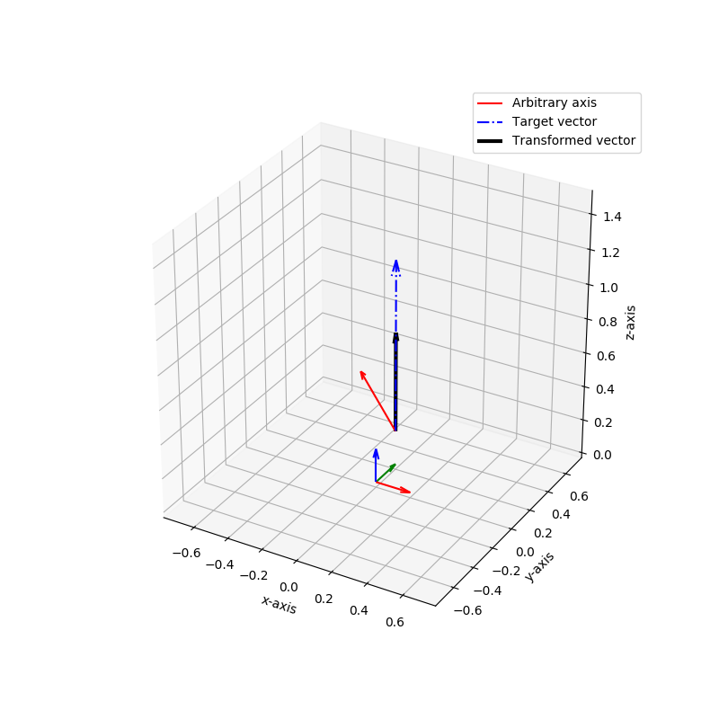

# Quaternion 
### rotation of an arbitrary axis to unit vector of z-axis

* Example of quaternion of one arbitrary axis

* Example of quaternion with multiple vectors (skeleton)

	* q = $-0.2x + 0.02y + 0.979$

	* Orignial skeleton data
	

	* Transformed skeleton data
	
